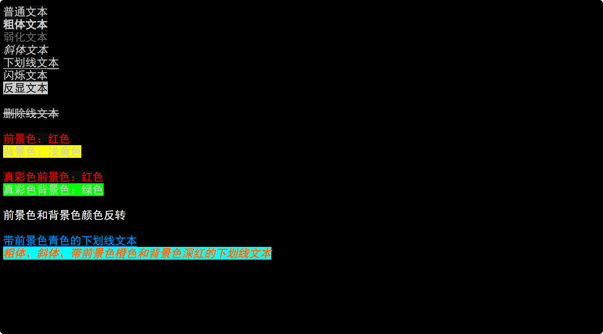

<p align="center">🇨🇳 中文简体  |  <a title="English" href="README_EN.md">🇬🇧 English</a></p>

# ansi2html

ansi2html 是一个Python程序，用于将包含ANSI转义序列的文本文件转换为带有HTML样式的文件。这使得可以在网页上直接显示原本只能在终端上看到的格式化文本。该项目支持多种ANSI样式和颜色格式，包括256色和真彩色，并提供了定制化的HTML样式以适应不同的显示需求。

## 安装

1. **依赖项**

   ansi2html 需要以下依赖项：
   - Python 3.x
   - tqdm (用于显示进度条)

   可以使用以下命令安装 tqdm：

   ```
   pip install tqdm
   ```

2. **克隆仓库**

   使用以下命令克隆此仓库：

   ```
   git clone https://github.com/happycola233/ansi2html.git
   cd ansi2html
   ```

## 使用方法

   运行 `ansi2html.py` 脚本并输入要处理的文本文件路径。程序将会自动将其转换为HTML格式并保存在与原文件相同的目录中。

   ```
   python src/中文版/ansi2html_CN.py
   ```


## 示例演示

以下是一些ANSI转义序列的样例和生成的HTML效果截图：

### ANSI转义序列样例

```plaintext
普通文本
粗体文本
弱化文本
斜体文本
下划线文本
闪烁文本
反显文本
隐藏文本
删除线文本

前景色：红色
背景色：浅黄色

真彩色前景色：红色
真彩色背景色：绿色

前景色和背景色颜色反转

带前景色青色的下划线文本
粗体、斜体、带前景色橙色和背景色深红的下划线文本
```

### HTML成品截图



#### 贡献

如果您发现了问题或者有改进的建议，请随时提交问题报告或者提出Pull Request。您的贡献将是这个项目进步的动力。

#### 许可

这个项目基于 MIT 许可，详细信息请参阅 `LICENSE` 文件。