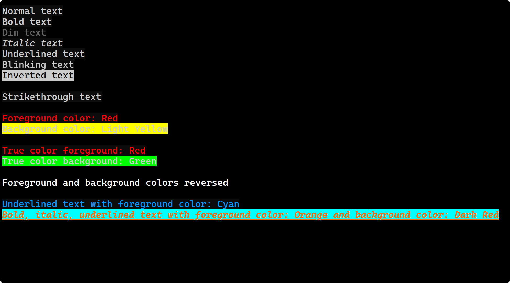

<p align="center"><a title="中文" href="/README.md">🇨🇳 中文简体</a> | 🇬🇧 English</p>

# ansi2html

ansi2html is a Python program designed to convert text files containing ANSI escape sequences into HTML-styled files. This allows formatted text that is typically only visible in terminals to be displayed directly on web pages. The project supports various ANSI styles and color formats, including 256 colors and true colors, and provides customizable HTML styles to meet different display needs.

## Installation

1. **Dependencies**

   ansi2html requires the following dependencies:
   - Python 3.x
   - tqdm (for displaying progress bars)

   You can install tqdm using the following command:

   ```
   pip install tqdm
   ```

2. **Clone the Repository**

   Clone the repository using the following command:

   ```
   git clone https://github.com/happycola233/ansi2html.git
   cd ansi2html
   ```

## Usage

   Run the `ansi2html.py` script and provide the path to the text file you want to process. The program will automatically convert it into HTML format and save it in the same directory as the original file.

   ```
   python src/English/ansi2html_EN.py
   ```

## Example Demonstrations

Below are examples of ANSI escape sequences and screenshots of the generated HTML output:

### ANSI Escape Sequence Examples

```plaintext
Normal text
Bold text
Dim text
Italic text
Underlined text
Blinking text
Inverted text
Hidden text
Strikethrough text

Foreground color: Red
Background color: Light Yellow

True color foreground: Red
True color background: Green

Foreground and background colors reversed

Underlined text with foreground color: Cyan
Bold, italic, underlined text with foreground color: Orange and background color: Dark Red
```

### HTML Output Screenshots



## Contributions

If you find any issues or have suggestions for improvement, please feel free to submit an issue or pull request. Your contributions are key to the advancement of this project.

## License

This project is licensed under the MIT License. For more details, please refer to the `LICENSE` file.